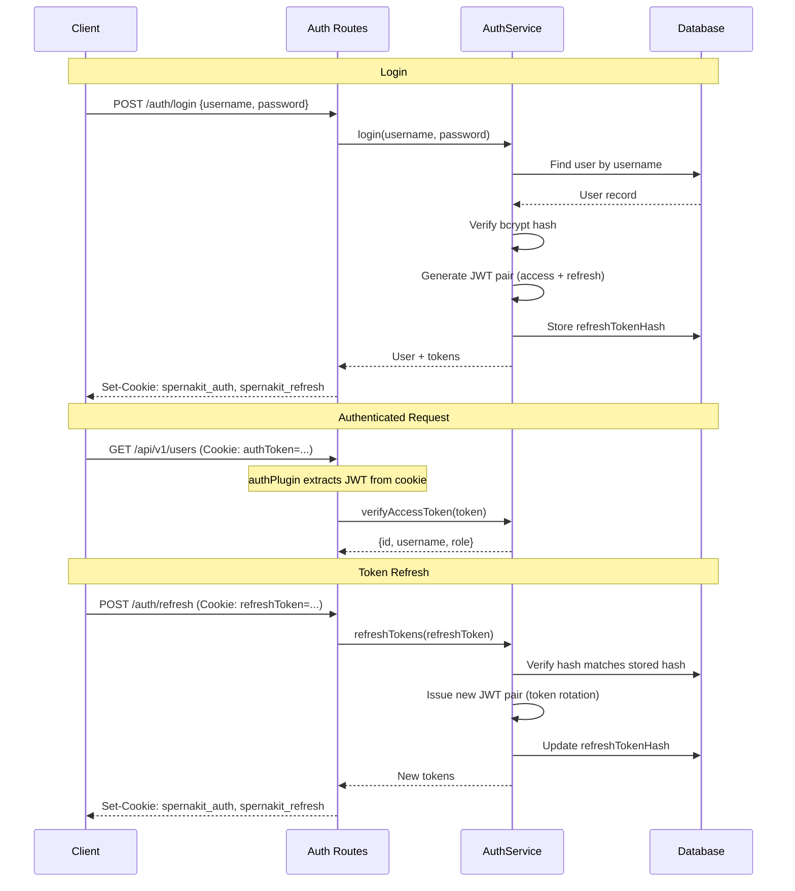
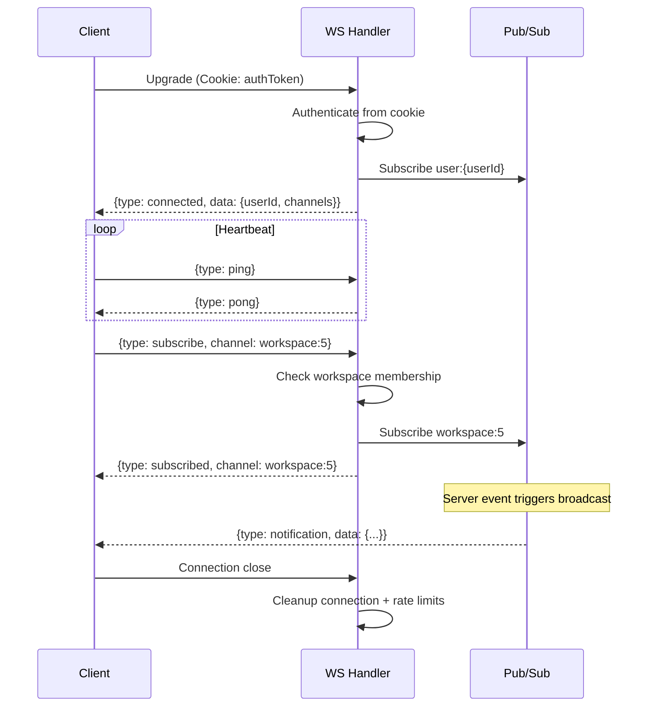

# Backend Architecture

Elysia-based REST API running on Bun with a plugin-oriented middleware stack.

## Plugin Chain

Plugins are registered in order and execute as an onion-model middleware stack:

```mermaid
graph LR
    req["Request"] --> rid["requestId"]
    rid --> log["logger"]
    log --> cors["cors"]
    cors --> sec["securityHeaders"]
    sec --> apk["apiKey"]
    apk --> auth["authPlugin<br/>(derive user)"]
    auth --> pcg["passwordChangeGuard"]
    pcg --> csrf["csrf"]
    csrf --> rl["rateLimit"]
    rl --> arl["authRateLimit"]
    arl --> ws["workspacePlugin<br/>(derive workspace)"]
    ws --> aud["auditPlugin"]
    aud --> handler["Route Handler"]
    handler --> svc["Service Layer"]
    svc --> db["Database"]
```

## Service Layer

Route modules are split by feature domain. Each delegates to a dedicated service. Services are the only layer that accesses the database.

```mermaid
graph TB
    subgraph "Routes (backend/src/routes/)"
        r_auth["auth-login, auth-me,<br/>auth-oauth, auth-refresh,<br/>auth-password-reset, auth-register,<br/>auth-utils"]
        r_users["users-crud, users-bulk,<br/>users-profile, users-api-keys"]
        r_ws_routes["workspaces-crud,<br/>workspaces-members,<br/>workspaces-members-bulk"]
        r_notif["notifications-crud,<br/>notifications-preferences-broadcast"]
        r_dash["dashboards-crud,<br/>dashboards-share-export,<br/>dashboards-templates-import"]
        r_settings["settings-general,<br/>settings-auth-security,<br/>settings-smtp, settings-user,<br/>settings-app-features"]
        r_system["system-dashboard,<br/>system-metrics, system-backup"]
        r_health["health-checks,<br/>health-alerts-config"]
        r_audit["audit"]
        r_tasks["tasks"]
        r_files["files"]
        r_bm["businessmetrics"]
        r_ws["ws, ws-broadcast"]
    end

    subgraph Services
        s_auth["authService"]
        s_users["userService"]
        s_ws_svc["workspaceService"]
        s_notif["notificationService"]
        s_dash["dashboardService"]
        s_settings["settingsService"]
        s_metrics["metricsService"]
        s_health["healthService"]
        s_audit["auditService"]
        s_sched["schedulerService"]
        s_files["fileService"]
        s_bm["businessMetricsService"]
        s_oauth["oauthService"]
        s_email["emailService"]
        s_apikey["apiKeyService"]
        s_smtp["smtpService"]
    end

    r_auth --> s_auth
    r_auth --> s_oauth
    r_users --> s_users
    r_users --> s_apikey
    r_ws_routes --> s_ws_svc
    r_notif --> s_notif
    r_dash --> s_dash
    r_settings --> s_settings
    r_settings --> s_smtp
    r_system --> s_metrics
    r_health --> s_health
    r_audit --> s_audit
    r_tasks --> s_sched
    r_files --> s_files
    r_bm --> s_bm

    subgraph Database
        drizzle["Drizzle ORM<br/>(bun:sqlite)"]
    end

    s_auth --> drizzle
    s_users --> drizzle
    s_ws_svc --> drizzle
    s_notif --> drizzle
    s_dash --> drizzle
    s_settings --> drizzle
    s_metrics --> drizzle
    s_health --> drizzle
    s_audit --> drizzle
    s_sched --> drizzle
    s_files --> drizzle
    s_bm --> drizzle
    s_apikey --> drizzle
    s_smtp --> drizzle
```

## Authentication Flow

> **Note:** Cookie names `spernakit_auth` and `spernakit_refresh` are defaults from `config.security.cookieNames`. Applications override these in their `spernakit.json` configuration.

## WebSocket Protocol

