# Database Schema

SQLite (default) or PostgreSQL database managed by Drizzle ORM.

> **Note:** Drizzle schema definitions live in two directories: `backend/src/db/schema/` for SQLite and `backend/src/db/schema-pg/` for PostgreSQL. Both describe the same logical schema, each in its own Drizzle dialect.

## Entity Relationship Diagram

```mermaid
erDiagram
    users ||--o{ workspaces : "owns"
    users ||--o{ workspace_members : "member of"
    workspaces ||--o{ workspace_members : "has members"
    users ||--o{ oauth_accounts : "has"
    users ||--o{ audit_logs : "creates"
    users ||--o{ business_events : "triggers"
    users ||--o{ notifications : "receives"
    users ||--|| user_notification_preferences : "has"
    users ||--o{ file_uploads : "uploads"
    users ||--o{ settings : "updates"
    users ||--o{ dashboard_configs : "owns"
    workspaces ||--o{ audit_logs : "scopes"
    workspaces ||--o{ business_events : "scopes"
    workspaces ||--o{ notifications : "scopes"
    workspaces ||--o{ file_uploads : "scopes"
    dashboard_configs ||--o{ dashboard_widgets : "contains"

    users {
        int id PK
        text username UK
        text email UK
        text passwordHash
        text role "SYSOP|ADMIN|MANAGER|OPERATOR|VIEWER"
        text refreshTokenHash
        text resetToken
        int resetTokenExpiresAt
        int requiresPasswordChange
        int emailVerified
        text emailVerificationToken
        int emailVerificationExpiresAt
        int passwordChangedAt
        int failedLoginAttempts
        int lockedUntil
        int lastLoginAt
        text lastLoginIp
        text csrfToken
        int isDeleted
        int deletedAt
        int deletedBy FK
        int createdAt
        int createdBy FK
        int updatedAt
        int updatedBy FK
    }

    workspaces {
        int id PK
        text name
        text slug UK
        text description
        int ownerId FK
        int isDefault
        text settings "JSON"
        int isDeleted
        int deletedAt
        int deletedBy FK
        int createdAt
        int createdBy FK
        int updatedAt
        int updatedBy FK
    }

    workspace_members {
        int id PK
        int workspaceId FK
        int userId FK
        text role "ADMIN|MANAGER|OPERATOR|VIEWER"
        int joinedAt
        int createdAt
        int createdBy FK
        int updatedAt
        int updatedBy FK
    }

    oauth_accounts {
        int id PK
        int userId FK
        text provider "google|github|microsoft"
        text providerAccountId
        text accessTokenEncrypted
        text accessTokenIv
        text accessTokenSalt
        text refreshTokenEncrypted
        text refreshTokenIv
        text refreshTokenSalt
        text profile "JSON"
        int isDeleted
        int deletedAt
        int deletedBy FK
        int createdAt
        int createdBy FK
        int updatedAt
        int updatedBy FK
    }

    notifications {
        int id PK
        int userId FK
        int workspaceId FK
        int createdBy FK
        text title
        text message
        text type "info|success|warning|error|system|security|marketing"
        text metadata "JSON"
        int readAt
        int isDeleted
        int deletedAt
        int deletedBy FK
        int createdAt
    }

    user_notification_preferences {
        int id PK
        int userId FK
        text preferences "JSON"
        int createdAt
        int createdBy FK
        int updatedAt
        int updatedBy FK
    }

    audit_logs {
        int id PK
        int userId FK
        int workspaceId FK
        text action
        text entityType
        text entityId
        text details "JSON"
        text ipAddress
        int createdAt
    }

    business_events {
        int id PK
        int userId FK
        int workspaceId FK
        text eventCategory
        text eventName
        text metadata "JSON"
        int createdAt
    }

    file_uploads {
        int id PK
        text filename
        text originalName
        text storagePath
        text thumbnailKey
        text mimeType
        int size
        int uploadedBy FK
        int workspaceId FK
        int isDeleted
        int deletedAt
        int deletedBy FK
        int createdAt
        int updatedAt
        int updatedBy FK
    }

    settings {
        int id PK
        text key UK
        text value
        text description
        int isEncrypted
        int isDeleted
        int deletedAt
        int deletedBy FK
        int createdAt
        int createdBy FK
        int updatedAt
        int updatedBy FK
    }

    dashboard_configs {
        int id PK
        int userId FK
        text name
        int isDefault
        text shareToken
        int shareExpiresAt
        int isDeleted
        int deletedAt
        int deletedBy FK
        int createdAt
        int createdBy FK
        int updatedAt
        int updatedBy FK
    }

    dashboard_widgets {
        int id PK
        int dashboardId FK
        text title
        text widgetType
        text metricType
        int row
        int col
        int width
        int height
        text timeRange
        int refreshInterval
        text options "JSON"
        int isDeleted
        int deletedAt
        int deletedBy FK
        int createdBy FK
        int updatedAt
        int updatedBy FK
    }

    system_metrics {
        int id PK
        text metricType
        real value
        real cpuUsage
        real memoryUsage
        real diskUsage
        real eventLoopLatency
        real heapTotal
        real heapUsed
        real rss
        text metadata "JSON"
        int createdAt
    }

    health_check_logs {
        int id PK
        text checkType
        text status "healthy|degraded|unhealthy"
        text details "JSON"
        int durationMs
        int createdAt
    }

    health_check_alerts {
        int id PK
        text checkType
        text severity "warn|critical"
        text message
        int acknowledgedAt
        int acknowledgedBy FK
        int resolvedAt
        int createdAt
    }

    scheduled_task_executions {
        int id PK
        text taskName
        text status "pending|running|completed|failed"
        int startedAt
        int completedAt
        int durationMs
        text result
        text error
        int createdAt
    }

    users ||--o{ api_keys : "owns"
    users ||--o{ token_blacklist : "owns"
    users ||--o{ password_history : "owns"

    api_keys {
        int id PK
        int createdBy FK
        text keyName
        text keyHash
        text keyIndexHash UK
        text keyScope "read|write|admin"
        text keySecret
        int isActive
        int expiresAt
        int lastUsedAt
        int createdAt
        int updatedAt
    }

    api_key_nonces {
        int id PK
        text nonce
        int createdAt
        int expiresAt
    }

    rate_limit_entries {
        int id PK
        text key
        int count
        int resetAt
        int createdAt
        int updatedAt
    }

    token_blacklist {
        int id PK
        text tokenHash
        int userId FK
        int createdAt
        int expiresAt
    }

    password_history {
        int id PK
        int userId FK
        text passwordHash
        int createdAt
    }
```

## Foreign Key Cascade Behavior

| Source Table                    | FK Column     | Target Table        | On Delete |
| ------------------------------- | ------------- | ------------------- | --------- |
| `workspaces`                    | `ownerId`     | `users`             | restrict  |
| `workspaces`                    | `createdBy`   | `users`             | set null  |
| `workspaces`                    | `updatedBy`   | `users`             | set null  |
| `workspaces`                    | `deletedBy`   | `users`             | set null  |
| `workspace_members`             | `workspaceId` | `workspaces`        | cascade   |
| `workspace_members`             | `userId`      | `users`             | cascade   |
| `workspace_members`             | `createdBy`   | `users`             | set null  |
| `workspace_members`             | `updatedBy`   | `users`             | set null  |
| `oauth_accounts`                | `userId`      | `users`             | cascade   |
| `oauth_accounts`                | `createdBy`   | `users`             | set null  |
| `oauth_accounts`                | `updatedBy`   | `users`             | set null  |
| `notifications`                 | `userId`      | `users`             | cascade   |
| `notifications`                 | `workspaceId` | `workspaces`        | cascade   |
| `notifications`                 | `createdBy`   | `users`             | set null  |
| `user_notification_preferences` | `userId`      | `users`             | cascade   |
| `user_notification_preferences` | `createdBy`   | `users`             | set null  |
| `user_notification_preferences` | `updatedBy`   | `users`             | set null  |
| `dashboard_configs`             | `userId`      | `users`             | cascade   |
| `dashboard_configs`             | `createdBy`   | `users`             | set null  |
| `dashboard_configs`             | `updatedBy`   | `users`             | set null  |
| `dashboard_widgets`             | `dashboardId` | `dashboard_configs` | cascade   |
| `audit_logs`                    | `userId`      | `users`             | set null  |
| `audit_logs`                    | `workspaceId` | `workspaces`        | set null  |
| `business_events`               | `userId`      | `users`             | set null  |
| `business_events`               | `workspaceId` | `workspaces`        | set null  |
| `file_uploads`                  | `uploadedBy`  | `users`             | set null  |
| `file_uploads`                  | `workspaceId` | `workspaces`        | set null  |
| `file_uploads`                  | `updatedBy`   | `users`             | set null  |
| `settings`                      | `createdBy`   | `users`             | set null  |
| `settings`                      | `updatedBy`   | `users`             | set null  |
| `notifications`                 | `deletedBy`   | `users`             | set null  |
| `oauth_accounts`                | `deletedBy`   | `users`             | set null  |
| `file_uploads`                  | `deletedBy`   | `users`             | set null  |
| `dashboard_configs`             | `deletedBy`   | `users`             | set null  |
| `dashboard_widgets`             | `deletedBy`   | `users`             | set null  |
| `dashboard_widgets`             | `createdBy`   | `users`             | set null  |
| `dashboard_widgets`             | `updatedBy`   | `users`             | set null  |
| `settings`                      | `deletedBy`   | `users`             | set null  |
| `api_keys`                      | `createdBy`   | `users`             | cascade   |
| `token_blacklist`               | `userId`      | `users`             | cascade   |
| `password_history`              | `userId`      | `users`             | cascade   |
