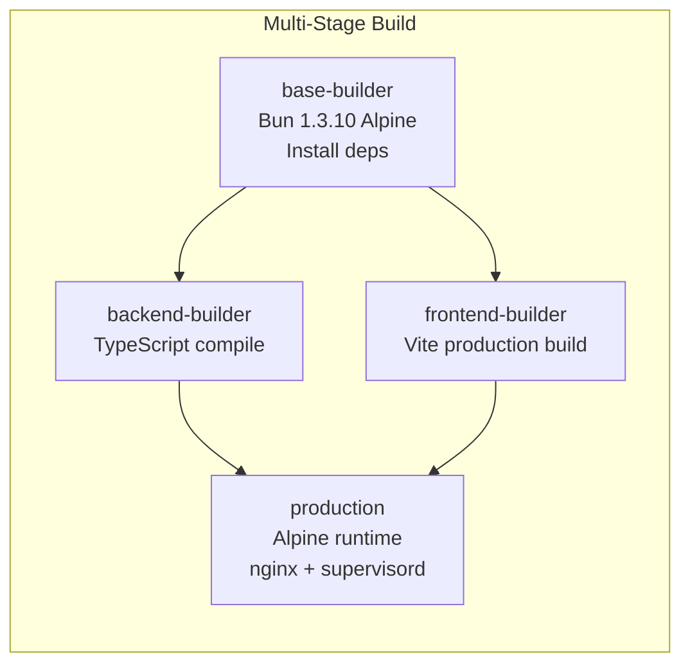
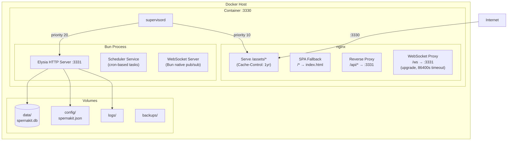
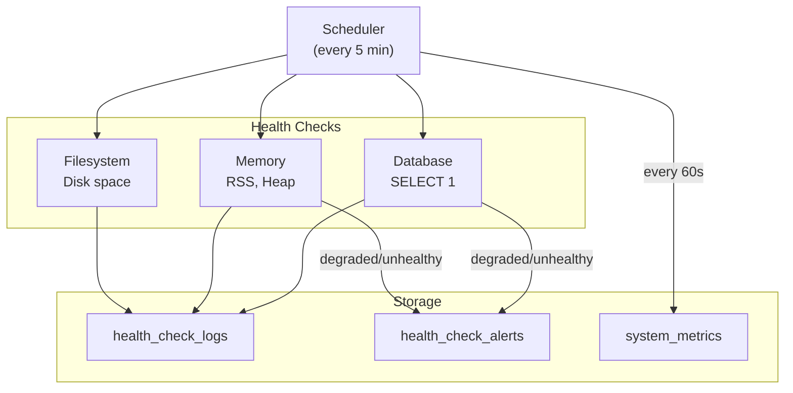

# Deployment Architecture

Docker-based deployment with nginx reverse proxy and supervisord process management.

## Docker Build Pipeline

## Runtime Architecture

## Configuration

The application loads configuration from:

1. **Schema defaults** (`backend/src/config/defaults.json`) -- built-in defaults
2. **Config file** (`config/spernakit.json`) -- user overrides merged on top
3. **Zod validation** -- validates merged config at startup

Key configuration sections:

| Section    | Controls                                      |
| ---------- | --------------------------------------------- |
| `server`   | Port, host, CORS origins                      |
| `database` | Path, WAL mode, connection settings           |
| `security` | JWT keys, token expiry, cookie settings, CSRF |
| `security` | CSP, rate limiting, HSTS                      |
| `logging`  | Log level, format                             |
| `email`    | SMTP host, port, credentials                  |
| `storage`  | File upload path, max size, S3 settings       |

## Health Monitoring

