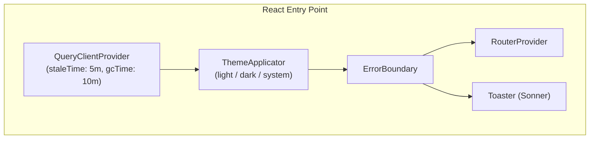
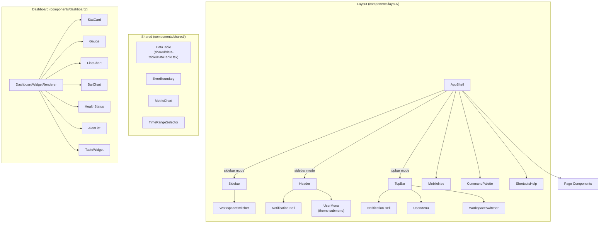

# Frontend Architecture

React 19 single-page application with TanStack Query, Zustand, and React Router.

## Provider Hierarchy

## Route Tree

```mermaid
graph TB
    root["/"]

    subgraph Public Routes
        login["/login<br/>LoginPage"]
        register["/register<br/>RegisterPage"]
        forgot["/forgot-password<br/>ResetPasswordPage"]
        reset["/reset-password<br/>ResetPasswordConfirmPage"]
        verify["/verify-email<br/>VerifyEmailPage"]
        changepw["/change-password<br/>ForcePasswordChangePage"]
        oauth["/auth/callback<br/>OAuthCallbackPage"]
        shared["/dashboards/shared/:token<br/>SharedDashboardPage"]
    end

    subgraph "Authenticated Shell (AppShell)"
        guard["ProtectedRoute"]

        onboarding["/onboarding<br/>OnboardingPage"]
        dash["/dashboard<br/>DashboardPage"]
        dblist["/dashboards<br/>DashboardListPage"]
        dbedit["/dashboards/:id<br/>CustomDashboardPage"]
        notif["/notifications<br/>NotificationsPage"]
        analytics["/analytics<br/>BusinessMetricsPage"]
        files["/files<br/>FilesPage"]
        workspaces["/workspaces<br/>WorkspaceManagementPage"]

        subgraph "Profile (tabbed)"
            prof_personal["/profile/personal<br/>PersonalInfoTab"]
            prof_prefs["/profile/preferences<br/>PreferencesTab"]
            prof_apikeys["/profile/api-keys<br/>ApiKeysTab"]
        end

        subgraph "Settings (tabbed)"
            s_app["/settings/application"]
            s_auth["/settings/authentication"]
            s_users["/settings/users"]
            s_roles["/settings/roles"]
            s_notif["/settings/notifications"]
            s_email["/settings/email"]
            s_health["/settings/system-health"]
            s_tasks["/settings/scheduled-tasks"]
            s_audit["/settings/audit-logs"]
            s_backup["/settings/backup"]
            s_db["/settings/database"]
            s_bugs["/settings/bugs"]
        end
    end

    root --> login
    root --> register
    root --> forgot
    root --> reset
    root --> verify
    root --> changepw
    root --> oauth
    root --> shared
    root --> guard
    guard --> onboarding
    guard --> dash
    guard --> dblist
    guard --> dbedit
    guard --> notif
    guard --> analytics
    guard --> files
    guard --> workspaces
    guard --> prof_personal
    guard --> prof_prefs
    guard --> prof_apikeys
    guard --> s_app
    guard --> s_auth
    guard --> s_users
    guard --> s_roles
    guard --> s_notif
    guard --> s_email
    guard --> s_health
    guard --> s_tasks
    guard --> s_audit
    guard --> s_backup
    guard --> s_db
    guard --> s_bugs
```

## Component Architecture

## State Management

Storage keys carry a version suffix (e.g., `spernakit-auth:v1`), defined in `lib/storageKeys.ts` so the stored schema can be migrated safely.

| Store            | Middleware | Key                      | Purpose                                             |
| ---------------- | ---------- | ------------------------ | --------------------------------------------------- |
| `authStore`      | persist    | `spernakit-auth:v1`      | User session, isAuthenticated flag (sessionStorage) |
| `themeStore`     | persist    | `spernakit-theme:v1`     | Theme mode (light/dark/system) + app color theme    |
| `layoutStore`    | persist    | `spernakit-layout:v1`    | Layout mode (sidebar/topbar) + container width      |
| `sidebarStore`   | persist    | `spernakit-sidebar:v1`   | Sidebar collapsed state                             |
| `workspaceStore` | persist    | `spernakit-workspace:v1` | Active workspace selection                          |
| `commandStore`   | -          | -                        | Command palette open/close                          |
| `wsStore`        | -          | -                        | WebSocket connection state, handlers                |
