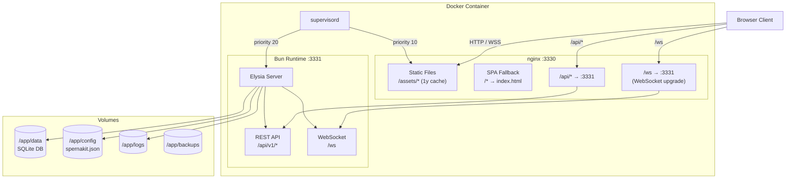
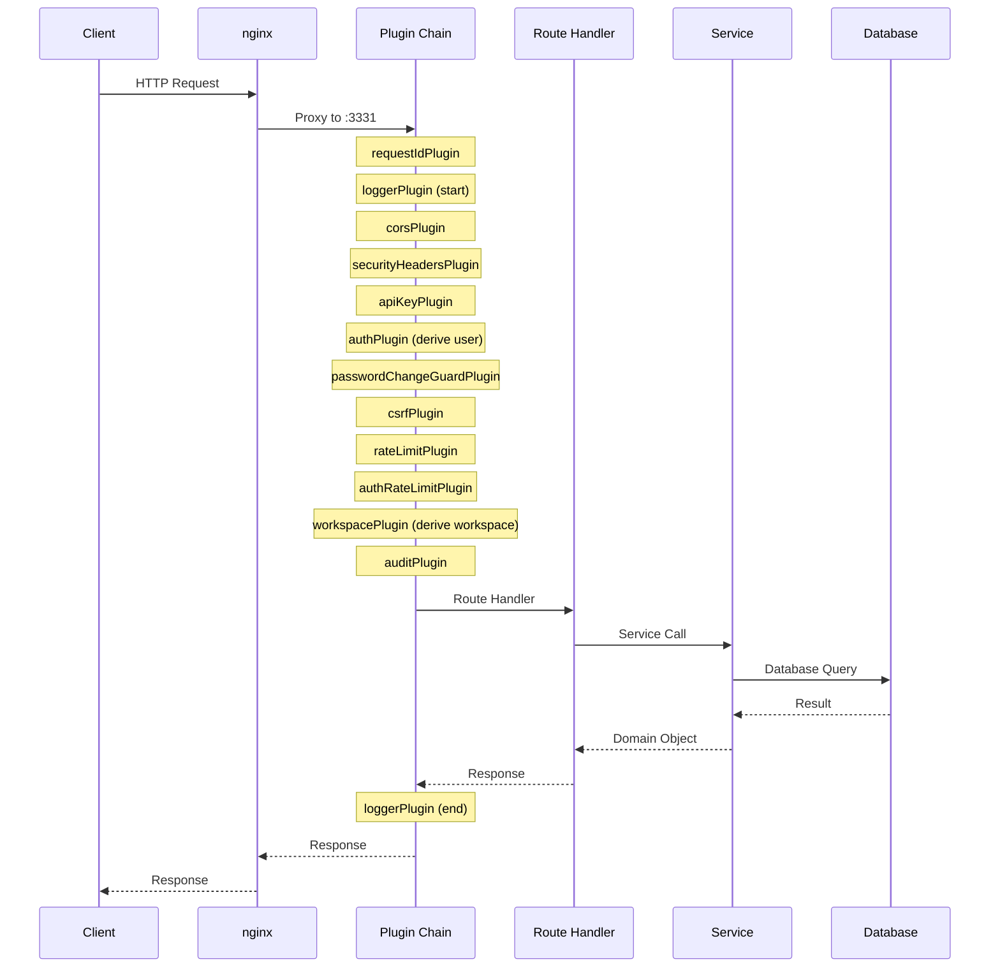

# System Architecture

How the Spernakit application is put together and deployed.

## Container Architecture

One Docker container runs two processes under supervisord:

## Request Flow

Each HTTP request travels this path through the middleware stack:

## Backend Route Modules

All API routes are registered under `/api/v1/`:

| Module Group     | Route Files                                                                                                                      | Prefix              | Purpose                              |
| ---------------- | -------------------------------------------------------------------------------------------------------------------------------- | ------------------- | ------------------------------------ |
| Auth             | `auth-login`, `auth-me`, `auth-oauth`, `auth-refresh`, `auth-password-reset`, `auth-register`, `auth-verify-email`, `auth-utils` | `/auth`             | Login, logout, refresh, OAuth, reset |
| Users            | `users-crud`, `users-bulk`, `users-profile`, `users-api-keys`                                                                    | `/users`            | User CRUD, batch ops, API keys       |
| Workspaces       | `workspaces-crud`, `workspaces-members`, `workspaces-members-bulk`                                                               | `/workspaces`       | Workspace CRUD, member management    |
| Notifications    | `notifications-crud`, `notifications-preferences-broadcast`                                                                      | `/notifications`    | Notification CRUD, preferences       |
| Dashboards       | `dashboards-crud`, `dashboards-share-export`, `dashboards-templates-import`                                                      | `/dashboards`       | Dashboard CRUD, sharing, templates   |
| Settings         | `settings-general`, `settings-auth-security`, `settings-smtp`, `settings-user`, `settings-app-features`                          | `/settings`         | Application and auth settings        |
| System           | `system-dashboard`, `system-metrics`, `system-backup`                                                                            | `/system`           | Dashboard stats, metrics, backups    |
| Health           | `health-checks`, `health-alerts-config`                                                                                          | `/health`           | Health checks, alert configuration   |
| Audit            | `audit`                                                                                                                          | `/audit`            | Audit log queries                    |
| Tasks            | `tasks`                                                                                                                          | `/tasks`            | Scheduled task management            |
| Files            | `files`                                                                                                                          | `/files`            | File upload and download             |
| Database Admin   | `database-admin`                                                                                                                 | `/database-admin`   | Schema introspection, data viewer    |
| Onboarding       | `onboarding`                                                                                                                     | `/onboarding`       | First-run onboarding wizard          |
| Bugs             | `bugs`                                                                                                                           | `/bugs`             | Bug reporting                        |
| Business Metrics | `businessmetrics`                                                                                                                | `/business-metrics` | Business event analytics             |
| WebSocket        | `ws` (`routes/ws/ws.ts`, `routes/ws/index.ts`), broadcast via `services/websocket/wsBroadcast.ts`                                | `/ws` (root-level)  | Real-time channel, broadcasting      |
